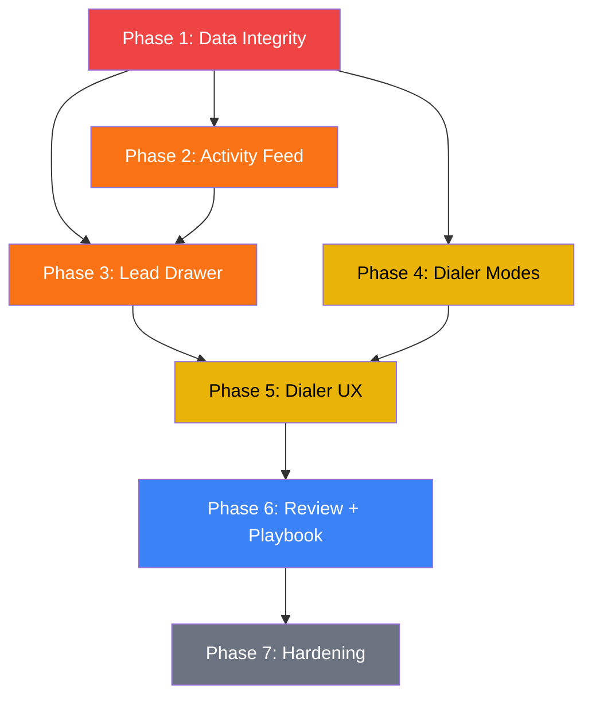

# CRM Master Plan — Unified Roadmap

> Synthesized from: `crm-war-plan.md`, `lead-drawer-redesign.md`, `lead-drawer-full-assessment.md`, `implementation_plan.md`, and `code_audit_report.md`.
> **Baseline commit**: `b4cc6b6` on `sandbox` (2026-02-15)

---

## The System This Must Enforce

```
Dialer (execute) → Log (capture) → Review (learn) → Playbook (codify) → Dialer (apply)
```

Every step must reliably feed the next. If any step is optional, hidden, or broken, the loop doesn't compound.

---

## Non-Negotiable Invariants

| # | Rule | Status |
|---|------|--------|
| 1 | **No fake attempts** — Call click creates `call_session` only. Attempt created only when rep logs outcome. | ⚠️ Bug exists in `app/page.tsx:133-145` (sandbox mode) |
| 2 | **No call timer** — OpenPhone is authoritative for duration. UI shows status, not a ticking clock. | ⚠️ Timer exists at `dial-session/page.tsx:168-177` |
| 3 | **Single canonical stage** — `leads.stage` is truth. No derived stage overrides. | ⚠️ `getEffectiveStage()` still used in table/kanban |
| 4 | **Tasks live in Dialer** — Lead Drawer shows summary + link only. | ❌ Not started |
| 5 | **Review outputs require evidence links** — Playbook rules must link to calls. | ❌ Not started |
| 6 | **No default dial mode** — Rep must choose what they're calling each session. | ❌ Not started |

---

## 🔒 LOCKED — Do Not Touch

> These files are working and protected. See `/dialer-invariants` workflow.

| File | What |
|------|------|
| `app/dial-session/page.tsx` | `initiateCall()` E.164 formatting, `logAttempt()` attempt linking |
| `supabase/migrations/20260215100000_auto_stitch_webhook_trigger.sql` | Auto-stitch trigger + phone normalizer |
| `supabase/migrations/20260215000000_robust_calls_views.sql` | `v_calls_with_artifacts` + `v_attempts_enriched` views |
| `components/CallsPanel.tsx` | Call History card in lead drawer |
| `hooks/useCallSync.ts` | Evidence polling for dialer |

---

## What's Done ✅

| # | Item | Commit |
|---|------|--------|
| 1 | Replace `tel:` with `openphone://` deep link | Part 1 |
| 2 | Clipboard fallback for web users | Part 1 |
| 3 | Supabase Realtime for auto call-end detection | Part 1 |
| 4 | Settings toggle: App vs Web dial mode | Part 1 |
| 5 | Wire CallsPanel into lead drawer | Part 1 |
| 6 | Fix E.164 phone format in `initiateCall()` | `9f74cfd` |
| 7 | DB auto-stitch trigger for recordings/transcripts | `9f74cfd` |
| 8 | Backfill existing unmatched sessions | `9f74cfd` |
| 9 | Evidence queue (background polling in dialer) | `code_audit_report` |
| 10 | Save & Next non-blocking (no artifact wait) | `code_audit_report` |
| 11 | Merge call session trigger (phone+time dedup) | `code_audit_report` |
| 12 | Protective invariants workflow | `b4cc6b6` |
| 13 | Template-driven batch review system | `code_audit_report` |
| 14 | Flexible field config (checkbox-driven) | Recent |
| 15 | Review templates tab | Recent |

---

## What Remains — 7 Phases

### Phase 1: Data Integrity (stop corrupting metrics)

> **Priority: CRITICAL** — everything downstream depends on clean data.

| # | Task | Files | Bug Source |
|---|------|-------|------------|
| 1.1 | Remove fake attempt from Call click in `app/page.tsx` (sandbox mode) | `app/page.tsx:133-145` | War Plan Bug 1 / Drawer Problem C |
| 1.2 | Remove client-side call timer `useEffect` + `callDuration` state | `dial-session/page.tsx:168-177` | War Plan Bug 2 |
| 1.3 | Remove `getEffectiveStage()` — use `leads.stage` everywhere | `lib/store.ts`, `app/page.tsx:109`, `leads-table.tsx`, `kanban-board.tsx` | War Plan Bug 4 / Drawer Problem B |
| 1.4 | Auto-promote stage on log: "Meeting set" → "Meeting Booked", etc. | `log-attempt-modal.tsx` | Drawer Move 3 |
| 1.5 | Fix double-write: remove `stage` from `handleSave` batch (already saved by `handleStageChange`) | `lead-drawer.tsx:184` | Drawer Problem A |

**Checkpoint**: Click Call → only `call_sessions` row, no `attempts`. No timer in DOM. Pipeline funnel uses `leads.stage` only.

---

### Phase 2: Activity Feed (make interactions timeline real)

> DB triggers eliminate fragility — they catch writes from UI, webhooks, N8N, and future integrations.

| # | Task | Files |
|---|------|-------|
| 2.1 | Create DB triggers for all activity types: attempt logged, stage changed, contact added/removed, task created/completed, tag added/removed | New migration |
| 2.2 | Remove unused `logActivity()` function from `use-lead-activities.ts` (it was never called) | `hooks/use-lead-activities.ts:113` |
| 2.3 | Refetch activities/tasks after attempt log (fix stale drawer) | `app/page.tsx:157-159` |

**Checkpoint**: Log attempt → activity feed shows "Attempt: DM reached" automatically. Change stage → feed shows "Stage: New → Contacted". Complete task → feed shows "Task completed: Follow up".

---

### Phase 3: Lead Drawer Cleanup

| # | Task | Files | Source |
|---|------|-------|--------|
| 3.1 | Auto-save all fields on blur (remove Edit/Save toggle) | `lead-drawer.tsx` | Drawer Move 1 |
| 3.2 | Fix `queueMicrotask` render hack → proper `useEffect` | `lead-drawer.tsx:141-148` | Drawer Move 6 / Problem H |
| 3.3 | Persist primary contact (`is_primary` column on contacts) | Migration + `lead-drawer.tsx:264-269` | Drawer Problem G |
| 3.4 | Collapse 3 overlapping call views into one unified Interactions timeline | Delete `CallsPanel.tsx` duplication in timeline, merge Last Attempt card | Drawer Move 5 / Problem E |
| 3.5 | Remove hardcoded fields: `segment`, `isDecisionMaker`, `isFleetOwner` | Dialer lead card, Add Lead, Leads Table, Import | Implementation Plan 2A |
| 3.6 | Remove verb validation from Next Call Objective | `lead-drawer.tsx:157` | Implementation Plan 2C |
| 3.7 | Pre-filter attempts in parent instead of O(n) scan | `app/page.tsx:150-154` | Drawer Problem — O(n) perf |

> [!IMPORTANT]
> Phase 3 touches the **locked** `CallsPanel.tsx` and `lead-drawer.tsx`. Get explicit approval before starting, and snapshot the baseline.

**Checkpoint**: No Edit/Save button. Every field saves on blur. One unified interactions timeline. Primary contact persists across reloads.

---

### Phase 4: Dialer Modes + Queue Snapshot

| # | Task | Files |
|---|------|-------|
| 4.1 | Create `dial_session_items` table + alter `dial_sessions` (add `mode`, `filters`) | New migration |
| 4.2 | Build `useDialModes()` hook — live counts per mode | `hooks/use-dial-modes.ts` [NEW] |
| 4.3 | Rebuild `useDialQueue()` to accept mode parameter | `hooks/use-dial-queue.ts` |
| 4.4 | Build Dialer Home: mode selector (New / Follow-ups / Interested / Nurture) with live counts | `dial-session/page.tsx` |
| 4.5 | Snapshot queue to `dial_session_items` at session start (prevents mid-session shifts) | `dial-session/page.tsx` |
| 4.6 | "Why this lead" label per queue item | `dial-session/page.tsx` |
| 4.7 | Connect sequences to dialer: sequence-driven tasks, "Sequences" dial mode | `dial-session/page.tsx`, enrollment hooks |

**Checkpoint**: Start session with "Follow-ups" → only leads with due tasks. Refresh → queue unchanged. "Sequences" mode shows only sequence tasks.

---

### Phase 5: Dialer UX Improvements

| # | Task | Files |
|---|------|-------|
| 5.1 | Pre-call stats row: attempt count, DM reaches, current stage | Context panel |
| 5.2 | Variable substitution in call scripts: `[company]` → actual name | `dial-session/page.tsx` |
| 5.3 | Auto-stage update after logging outcomes | `log-attempt-modal.tsx` |
| 5.4 | Move MissionControl (today's pace) from Dashboard into Dialer Home | `dial-session/page.tsx`, `mission-control.tsx` |
| 5.5 | Move task management into Dialer, replace with summary in Lead Drawer | `lead-drawer.tsx`, `dial-session/page.tsx` |
| 5.6 | "Dial" button per task in Tasks Dashboard | `dashboard/page.tsx` |

**Checkpoint**: Context panel shows "3 calls · 1 DM · Stage: Contacted". Scripts show real names. Dashboard is long-term trends only.

---

### Phase 6: Review + Playbook Loop

| # | Task | Files |
|---|------|-------|
| 6.1 | Create `call_reviews` + `playbook_evidence` tables | New migration |
| 6.2 | Quick Batch sub-tab: tag calls → extract market intel → promote to playbook | `batch-review/page.tsx` |
| 6.3 | Persist batch review results to `call_reviews` (fix: currently lost on refresh) | `batch-review/page.tsx:166-168` |
| 6.4 | Deep Dive sub-tab: rubric scoring (6 dimensions — opening, discovery, control, objections, close, next step) | Review page |
| 6.5 | **Top 10 vs Bottom 10 calls**: auto-rank from rubric scores, side-by-side comparison with playback links | Review page |
| 6.6 | Playbook evidence links: each rule shows linked calls with "Play" button | `playbook/page.tsx` |
| 6.7 | Call Prep panel in Dialer: relevant playbook rules for current lead | `dial-session/page.tsx` |
| 6.8 | "Review this session" CTA on dial session end → navigates to Review scoped to session | `dial-session/page.tsx` |

**Checkpoint**: Tag 5 calls → promote 2 to playbook → refresh → reviews persisted. Playbook shows evidence links. Dialer shows relevant rules during calls.

---

### Phase 7: Hardening + Polish

| # | Task | Files |
|---|------|-------|
| 7.1 | RLS policies on new tables (`call_reviews`, `playbook_evidence`, `dial_session_items`) | Migration |
| 7.2 | Audit all DB trigger coverage → verify `lead_activities` is complete | Migration check |
| 7.3 | Auto-create default contact when adding lead with phone | `app/page.tsx` or hook |
| 7.4 | Dashboard: pipeline value widget + overdue tasks widget | `dashboard/page.tsx` |
| 7.5 | Kanban: show deal value on cards | `kanban-board.tsx` |
| 7.6 | Update sidebar nav: rename "Batch Review" → "Review", reorder by usage frequency | `app-sidebar.tsx` |
| 7.7 | Log workflow executions (N8N) to `lead_activities` | DB trigger or webhook |

**Checkpoint**: Full security audit passes. Dashboard shows long-term trends. All surfaces consistent.

---

## Surface Ownership (Final State)

| Surface | Owns | Does NOT Own |
|---------|------|-------------|
| **Dialer** | Today's metrics, task queue, dial modes, call execution, inline logging, call prep (playbook) | Historical analytics, lead detail editing |
| **Leads / Drawer** | Account Reality, contacts, interactions timeline (read-only), task summary (link to Dialer) | Task management, call recordings (those live in timeline) |
| **Review** | Quick Batch (market intel), Deep Dive (skill coaching), evidence linking | Playbook rule management |
| **Playbook** | Rules, stop signals, drills — all with evidence links to calls | Rule creation (that happens in Review) |
| **Dashboard** | 7/30/90-day trends, pipeline funnel, stage velocity, cohort performance | Daily metrics (those live in Dialer) |

---

## Dependency Graph



---

## AI Handoff Block

Copy this to the top of any task given to an AI agent working on this CRM:

```
LOCKED FILES — DO NOT MODIFY without explicit user approval:
  - app/dial-session/page.tsx (initiateCall, logAttempt, useCallSync)
  - supabase/migrations/20260215100000_auto_stitch_webhook_trigger.sql
  - supabase/migrations/20260215000000_robust_calls_views.sql
  - components/CallsPanel.tsx
  - hooks/useCallSync.ts
  Rollback commit: 9f74cfd

DO NOT:
  - Create attempts on Call click
  - Implement a call duration timer
  - Use getEffectiveStage() for display
  - Put daily metrics on Dashboard
  - Pre-select a default dial mode

MUST:
  - Use leads.stage as canonical stage source
  - Log all mutations via DB triggers (not frontend logActivity calls)
  - Snapshot dial queues at session start
  - Persist all review data to call_reviews table
  - Link playbook rules to call evidence
```
